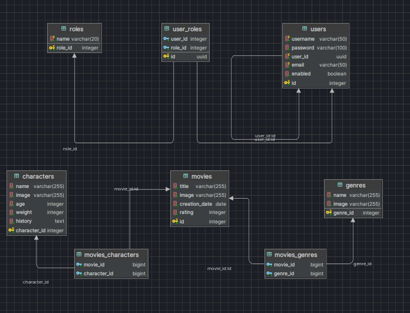

# Challenge Alkemy

## :notebook: Descripción

Proyecto practica implementando lo solicitado en un [challenge](CHALLENGE.md), proporcionado por Alkemy.

## 🛠️ Stack

- Java 17
- Spring Boot 3.2.3
- Spring Security
- PostgreSQL
- Liquibase

## :gear: Configuración

### EnvFile

1. Instalar plugin EnvFile.
2. Crea y completa un archivo .env en base al archivo .example.env.
3. Editar configuración de ejecución:
  - Ve a "Run/Debug Configurations".
  - Selecciona la configuración de ejecución que deseas editar.
  - En la sección de "Environment variables", agrega las variables de entorno definidas en tu archivo '.env'.

### Docker
El proyecto contiene un archivo docker-compose.yml, donde tenemos la base de datos del mismo. Antes de iniciar el proyecto debemos ejecutar en la raiz del proyecto.

```bash
docker compose up -d
```

Si no tenemos instalado docker podemos configurar localmente la base de datos. Tener en cuenta que al trabajar con liquibase solo necesitamos tener creada la base de datos luego este se encargara de crear la estructura de base de datos

### Estructura Base de Datos



## :key: Licencia

[MIT](LICENCE.txt) - Creado por **joalvaredev**.
